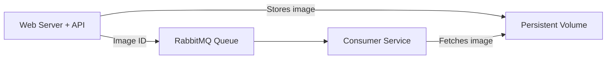

# Kubernetes & Helm – AI Image Processing Pipeline

## Overview
This project demonstrates the deployment of a scalable AI-based image processing pipeline on Kubernetes, leveraging **Helm** for application management.  
The system simulates a real-world architecture for processing radiology images, integrating **RabbitMQ** for message queuing, **Persistent Volumes** for data durability, and a **microservices** approach for modularity and scalability.

Key goals:
- Showcase Kubernetes orchestration with Helm.
- Implement reliable message queue handling.
- Enable persistent storage for shared data across services.
- Demonstrate an end-to-end image processing workflow.

---

## Architecture

### High-Level Design (Mermaid)


### Visual Diagram


### Components
| Service        | Description | Technology Stack |
|----------------|-------------|------------------|
| Web Server + API | Accepts image uploads, stores them, sends IDs to queue | Python, Flask |
| Queue Service  | Manages processing requests | RabbitMQ |
| Consumer Service | Retrieves images, analyzes them, logs results | Python |
| Persistent Storage | Shared data store for images and queue data | Kubernetes PVC |

---

## Technologies Used
- **Kubernetes** (Minikube for local testing)
- **Helm** (package management & templating)
- **RabbitMQ** (message broker)
- **Docker** (containerization)
- **Python** (application logic)
- **kubectl** (cluster management)

---

## Deployment Guide

### Prerequisites
- Docker installed
- Minikube installed
- Helm installed

### Steps
1. **Start Minikube**
   ```bash
   minikube start
   ```

2. **Deploy RabbitMQ**
   ```bash
   helm install my-rabbitmq ./charts/rabbitmq-chart
   ```

3. **Deploy Web Server**
   ```bash
   helm install my-web-server ./charts/web-server-chart
   ```

4. **Deploy Consumer Service**
   ```bash
   helm install my-consumer ./charts/consumer-chart
   ```

5. **Verify Deployments**
   ```bash
   helm list
   kubectl get all
   ```

---

## Testing

### 1. Upload Image via API
```bash
curl -X POST -F 'image=@<path_to_image>' $(minikube service web-server --url)/upload
```
You should receive a success message with a correlation ID.

### 2. Check RabbitMQ Queue
```bash
kubectl port-forward svc/rabbitmq 15672:15672
```
Visit `http://localhost:15672` and confirm the image ID is in the queue.

### 3. Monitor Consumer Logs
```bash
kubectl logs deployment/consumer
```
The logs should show image retrieval and classification (dog/cat).

---

## Best Practices Implemented
- Persistent Volumes for durability
- Modular Helm charts for each service
- Isolated microservices for scalability
- End-to-end testing procedure

---

## Potential Improvements
- **Resource Requests & Limits** for CPU/memory in deployments.
- **Liveness & Readiness Probes** for better health checks.
- **Infrastructure as Code** integration with Terraform.
- Migration from Minikube to **Amazon EKS** for production-grade scaling.
- CI/CD pipeline for automated deployment.

---

## Learnings & Takeaways
This project strengthened my skills in:
- Deploying multi-service applications on Kubernetes.
- Using Helm for streamlined application management.
- Implementing persistent data handling in a containerized environment.
- Structuring DevOps workflows for reproducibility and scalability.

---

## Command & File Reference

| Action | Command / File | Purpose |
|--------|----------------|---------|
| Start Minikube | `minikube start` | Launch local K8s cluster |
| Deploy RabbitMQ | `helm install my-rabbitmq ./charts/rabbitmq-chart` | Message broker |
| Deploy Web Server | `helm install my-web-server ./charts/web-server-chart` | API for uploads |
| Deploy Consumer | `helm install my-consumer ./charts/consumer-chart` | Image processing |
| Check services | `kubectl get all` | View all resources |
| Check logs | `kubectl logs deployment/<name>` | View pod logs |
| PVC definition | `queue-service.yaml` / `web-server.yaml` | Persistent volume claims |

---

## Screenshots

### Helm and Kubernetes Resources


### RabbitMQ Dashboard


### Consumer Logs Processing


### End-to-End Flow Confirmation

